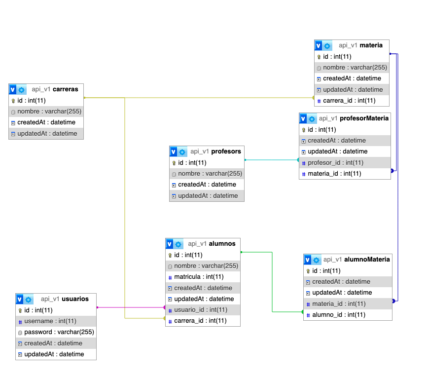

# TP API 

## Tecnologías

- [Node js](https://nodejs.org/es)
- [Express js](https://expressjs.com/es/)
- [Sequelize ORM](https://sequelize.org/docs/v6/)

### Funcionalidades

- Paginación
- Cache en peticiones 
- Registro de logs
- Renderizado en frontend desde backend
- Cookies
- JWT
- Test
- Hash de password

